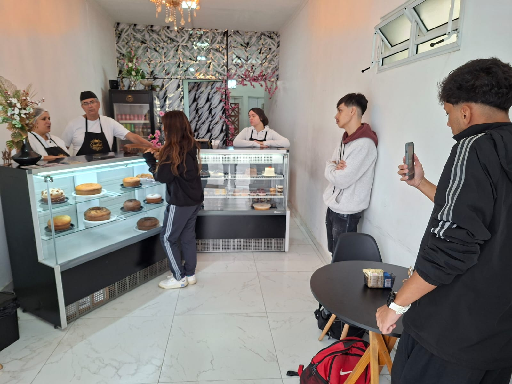
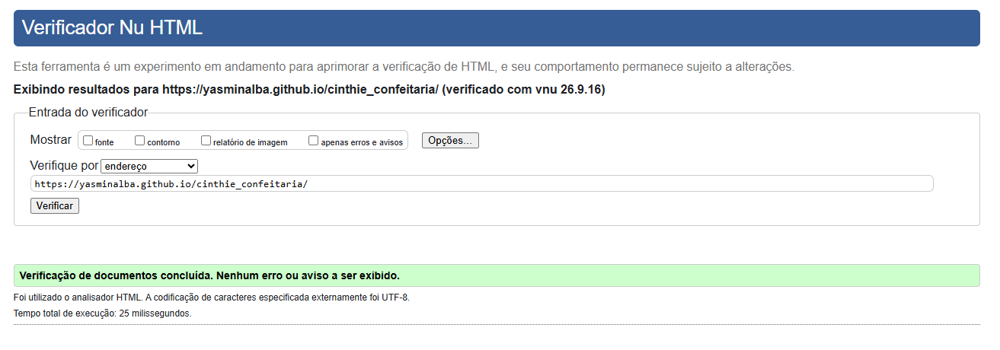

# 🍰 Cinthiê Confeitaria

## 1. Nomes dos alunos

- Ryan Everton Andrade Simões — RGM: 47647663 - GitHub: 8enn7
- Vinicius Ferreira da Silva — RA: 47432691 - GitHub: viniferreiradevtech
- Yasmin America Mollinedo Alba — RA: 47071303 - GitHub: yasminalba
- Nicolas Miguel Tavares — RA: 47658037 - GitHub: nicolasmigueltavares2007-maker
- João Paulo de Lima Rodrigues — RA: 47850876 - GitHub: jotinzl

## 2. Introdução

A Cinthiê Confeitaria é uma organização voltada para a produção e venda de produtos de confeitaria.

O grupo escolheu a Cinthiê para desenvolver um site com o objetivo de apresentar melhor a confeitaria, seus produtos e serviços, além de facilitar o acesso dos clientes às informações do estabelecimento.

A proposta foi criar um site organizado e fácil de navegar, apresentando os principais conteúdos da confeitaria de forma simples e agradável para os usuários.

## 3. Desenvolvimento

### Entrevista e visita à organização

Para conhecer melhor a Cinthiê Confeitaria e entender suas necessidades, o grupo realizou uma visita presencial à organização.

Durante a visita, conhecemos o espaço, observamos como o estabelecimento funciona e conversamos com os responsáveis. Também levantamos informações sobre os produtos oferecidos, os serviços e a forma de atendimento aos clientes.

Essas informações ajudaram o grupo a definir quais conteúdos seriam apresentados no site e como eles seriam organizados nas páginas.

### Registro do contato

A foto abaixo registra o contato do grupo com a organização durante a visita presencial:

Forma de contato utilizada: visita presencial.

### Formas de contato da Confeitaria

Whathsapp: (11) 93935-9449.

Instagram: confeitaria_cinthie.

### Desenvolvimento do site

Depois da visita, o grupo organizou as informações levantadas e definiu a estrutura do site.

Com base no conteúdo levantado, definimos as páginas que fariam parte do projeto: página inicial, produtos, novidades, galeria, contato e orçamento.

O site foi desenvolvido em HTML5, com foco na estruturação e organização do conteúdo. Usamos elementos semânticos, links de navegação, imagens, vídeo, áudio e formulários, seguindo os requisitos da atividade.

Ao longo do desenvolvimento, procuramos manter as informações organizadas e criar uma navegação simples entre as páginas, sempre relacionando o conteúdo à realidade da Cinthiê Confeitaria.

### Desafios encontrados

Os principais desafios foram organizar o conteúdo de cada página, decidir a melhor forma de apresentar as informações e garantir que todas as páginas ficassem corretamente interligadas.

Também precisamos ajustar links de navegação, imagens, vídeo, áudio e formulários, além de organizar os arquivos do projeto.

Trabalhar em grupo também foi um desafio à parte: organizar os arquivos e as alterações de cada integrante usando Git e GitHub exigiu comunicação e alinhamento constante entre todos.

Esses desafios ajudaram o grupo a entender melhor como estruturar um site em HTML5 e a colocar em prática o que foi estudado em aula.

## 4. Conclusão

Desenvolver o site da Cinthiê Confeitaria permitiu ao grupo colocar em prática os conhecimentos aprendidos na disciplina.

A visita presencial foi essencial para conhecer melhor a organização e entender quais informações usar no site. A partir desse contato, transformamos o que levantamos em conteúdos e páginas voltados para a realidade da confeitaria.

Ao longo do projeto, aprofundamos nosso conhecimento em HTML5, organização de páginas, estrutura semântica, formulários, recursos multimídia e Git/GitHub, além de ganhar mais experiência trabalhando em grupo.

Apesar dos desafios ao longo do desenvolvimento, o projeto contribuiu para o aprendizado do grupo e resultou em uma estrutura de site que representa bem a Cinthiê Confeitaria e sua proposta.

Essa primeira etapa também vai servir de base para a continuação do projeto nas próximas etapas da atividade.

## 5. Site hospedado

🔗 [Acesse o site da Cinthiê Confeitaria](https://yasminalba.github.io/cinthie_confeitaria/)

## 6. Validador W3C

✅ Todas as páginas foram validadas no Validador W3C, sem erros ou avisos.

